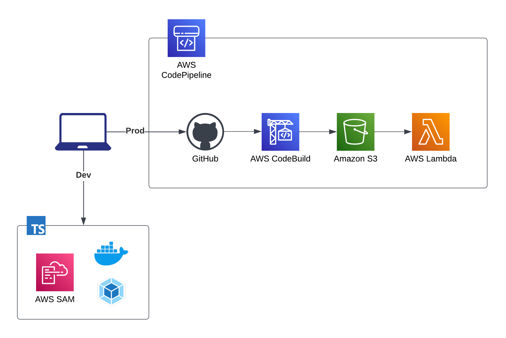

<h1>AWS Lambda in Typescript Template</h1>

<p>Template for developing and provisioning AWS Lambda Function in Typescript</p>

<h2>Overview</h2>

<h3>Motivations</h3>

<p>AWS Sam CLI - a great tool for developing and deploying Lambda function - only supports TypeScript in <a href="https://aws.amazon.com/blogs/compute/building-typescript-projects-with-aws-sam-cli/">Beta</a> (by 12/11/2022).</p>

<p>Also, I want to use Webpack to bundle AWS Lambda function handler and its dependencies instead of <a href="https://docs.aws.amazon.com/lambda/latest/dg/typescript-package.html">esbuild</a> or <a href="https://docs.aws.amazon.com/lambda/latest/dg/lambda-typescript.html">tsc</a> as illustrated in the docs.</p>

<p>Provisioning AWS Lambda function in a synchronized CI/CD Pipeline involves setting up many cloud resources which should be simplified for increasing productivity.</p>

<p>I truly believe this template can help you focus more on the coding process and be less worried about the underlying infrastructure.</p>

<h3>Architecture</h3>



<h2>Getting Started</h2>

<p>These instructions will give you a kickstart on developing and deploying AWS Lambda function. <br> Feel free to use and customize this template for your own preferences.</p>

<h3>Prerequisites</h3>

<p>Before you start, please make sure to have the following technologies installed and configured.</p>

<ul>
  <li>
    <a href="https://docs.aws.amazon.com/cli/latest/userguide/cli-chap-getting-started.html">
      AWS CLI
    </a>
  </li>
  <li>
    <a href="https://docs.aws.amazon.com/serverless-application-model/latest/developerguide/install-sam-cli.html#install-sam-cli-instructions">
      AWS SAM CLI
    </a>
  </li>
  <li>
    <a href="https://docs.docker.com/engine/install/">
      Docker - Docker Engine
    </a>
  </li>
  <li>
    <a href="https://developer.hashicorp.com/terraform/downloads">
      Terraform
    </a>
  </li>
  <li>
    <a href="https://registry.terraform.io/providers/hashicorp/aws/latest/docs">
      Terraform - AWS Provider
    </a>
  </li>
  <li>
    <a href="https://github.com/git-guides/install-git">
      GitHub - Git
    </a>
  </li>
</ul>

<h3>Installing</h3>

```sh
# Install dependencies
npm install
```

<p><code>npm install</code> installs <a href="https://prettier.io/docs/en/index.html">Prettier</a>, <a href="https://typicode.github.io/husky/#/">husky</a>, and <a href="https://commitlint.js.org/#/">commitlint</a> which are used to ensure code and commit messages conforms to consistent style.</p>

<h3>Usage</h3>

```sh
# Run local lambda with live-reloading
npm run dev
```

<p><code>npm run dev</code> runs <code>webpack --watch</code> and <code>sam local start-api</code> concurrently. Webpack watches for changes to TypeScript code under <code>src/</code> and updates the JavaScript bundle under <code>build/</code>. <code>sam local start-api</code> automatically refers to these changes and reloads local server.</p>

<p>Finally, this process achieves my desired live-reloading feature for developing and testing AWS Lambda function locally with TypeScript. Learn more <a href="https://docs.aws.amazon.com/serverless-application-model/latest/developerguide/serverless-sam-cli-using-start-api.html">here</a>.</p>

<p>Developer should leverage <code>AWS SAM CLI</code> functionalities to work with AWS Lambda functions and other Serverless resources.</p>

<p><b>Note:</b> Live-reloading requires <b>Docker</b> to run in the background to simulate AWS Lambda runtime environment.</p>

<h3>Testing</h3>

<p>I use <a href="https://jestjs.io/docs/getting-started">Jest</a> to run unit-tests on the source code. Write more tests <code>**.test.ts</code> under <code>tests/</code> folder</p>

```sh
# Run unit-tests
npm run test
```

<h3>Troubleshooting</h3>

<p>If <code>sam-cli</code> returns the following error (which happened to me)</p>

```sh
npm run dev
...
Docker error: "Cannot connect to the Docker daemon. Is the docker daemon running on this host?"
```

<p>
  1. Make sure <b>Docker</b> is running</li><br>
  2. Make sure <code>sam-cli</code> can communicate with <code>docker daemon</code> by exporting <code>DOCKER_HOST</code> to your local machine's <code>env</code>. <code>DOCKER_HOST</code>(i.e. <code>docker.sock</code>) is the UNIX socket that Docker daemon is listening to.
</p>

```sh
# 1. Locate docker.sock location on your local machine
docker info # Try other methods of it does not work
...
ERROR: Cannot connect to the Docker daemon at unix:///.../docker.sock. Is the docker daemon running?

# 2. Export this path to DOCKER_HOST environment variable
export DOCKER_HOST=unix:///.../docker.sock
```

<h2>Deployment</h2>

<p>Make sure that you have <a href="https://developer.hashicorp.com/terraform/downloads">Terraform CLI</a> installed.</p>

<p>Under <code>terraform/</code>, there are <code>*.tf</code> files which define resources needed for the CI/CD pipeline.</p>

<p>Required environment variables are 
<code>AWS_REGION</code>, <code>AWS_ACCOUNT_ID</code>, <code>LAMBDA_FUNCTION_NAME</code>. Define these variables in <code>terraform/variables.tfvars</code></p>

```sh
# terraform/variables.tfvars
AWS_REGION = "{{region}}"
AWS_ACCOUNT_ID = "{{ID of AWS account}}"
LAMBDA_FUNCTION_NAME = "{{name of lambda function}}"

# Before deployment
cd terraform
terraform init
chmod +x ./apply.sh

# Run deployment
./apply.sh
# OR
terraform apply -var-file="variables.tfvars"
```

<h2>Author</h2>

<ul>
  <li><b>Tim Huynh</b> - Northwestern University - 
  <a href="https://www.linkedin.com/in/qthuynh9501/">LinkedIn</a> - 
  <a href="https://github.com/TimHuynh0905">GitHub</a> - 
  <a href="https://www.quocthuynh.com/">Portfolio</a></li>
</ul>
